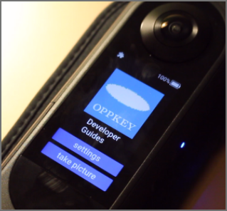
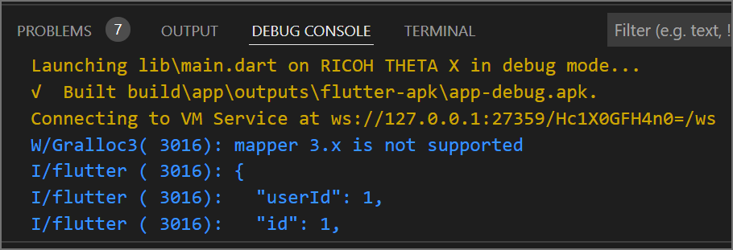

# logo_demo for RICOH THETA X



[video demo](https://youtu.be/F5LBPCAcKA8?feature=shared)

[Official plugin development information from RICOH](https://github.com/ricohapi/theta-api-specs/tree/main/ricoh-theta-plugin)

## Overview

This is a demonstration of the API functionality of the RICOH THETA X plugin technology. The demo was made for a community video, not as a developer reference.  

Features shown:

* logo display
* LCD scroll
* move to next screen
* take picture
* set option
* access external API site
* return control to THETA internal app

## limitations of demo

The code is not intended as a reference.  The main goal was to show that the camera LCD was usable with a plugin. When take picture is pressed, there is a delay of several seconds.


## debug plugin with adb connection over USB or Ethernet

While connected to USB

```text
adb tcpip 5555
```

While connected to Ethernet

```text
adb connect 192.168.2.101:5555
```

adb will not function normally over Ethernet.

```text
adb devices
List of devices attached
192.168.2.101:5555      device
```

VS Code works with adb over Ethernet.



---

Request permissions

`adb shell am start -a android.settings.SETTINGS`

Enable logcat

`adb shell setprop persist.log.tag 0`

Disable logcat

`adb shell setprop persist.log.tag A`

View logcat

`adb logcat | grep theta_debug`
